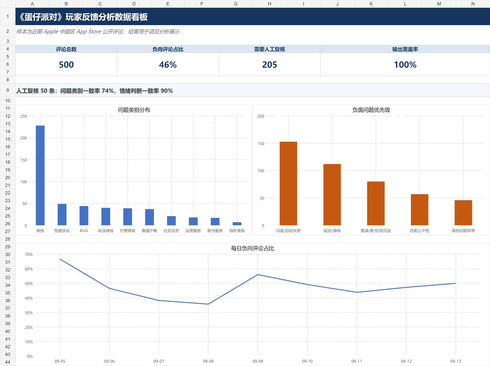

# AI 驱动的游戏玩家反馈分析与运营助手

这是一个围绕游戏运营场景完成的个人项目。我选择《蛋仔派对》作为分析对象，从 Apple 中国区 App Store 整理 500 条近期公开评论，再用 Python 调用 DeepSeek API，把自然语言评论转换为可统计的运营数据。

程序会为每条评论判断主要问题、情绪、负向强度和实际影响，并给出摘要、证据片段、处理建议和人工复核标记。最终结果写入 JSON 与 CSV，再汇总到 Excel 数据看板中。



## 项目结果

本次运行完成了 500 条评论的分析，输出覆盖率为 100%。其中负向评论 230 条，占 46%；205 条因信息不足、多诉求或高影响被列入人工复核队列。

优先级按照每条负向评论的“情绪强度 × 影响程度”累加。闪退和启动失败以 153 分排在第一位，延迟和掉线为 112 分，登录、账号和防沉迷问题为 80 分。网络问题的负向评论数量略高于闪退，但闪退中有更多评论明确描述无法进入游戏，因此优先级更高。

我另外抽取 50 条评论进行人工复核。问题类别与人工判断的一致率为 74%，情绪判断一致率为 90%，评估覆盖率为 100%。主要分歧集中在玩法体验与数值平衡、视听表现等相邻类别之间。

## 分析方法

处理流程为：评论读取 → 大模型分析 → 结果校验 → 断点续跑 → 汇总统计 → 人工复核 → Excel 展示。

分类体系覆盖 BUG、数值平衡、玩法体验、性能优化、视听表现、付费体验、账号服务、运营服务、社区生态和其他。每条评论只选择一个主问题。遇到反讽、退游表达、泛化表扬和多诉求评论时，Prompt 使用单独规则，减少情绪误判和类别漂移。

代码会检查模型返回字段、取值范围和原文证据。调用失败的评论保留错误状态，重新运行时只重试未成功项目，避免重复消耗 API。

## 文件说明

`main.py` 包含评论获取、批量分析、结果校验、报表生成和人工评估逻辑；`prompt.txt` 保存最终分类规则；`day2.ps1` 提供试跑、全量运行和评估入口；`portfolio/game_feedback_dashboard.xlsx` 是可查看明细的 Excel 数据看板；`portfolio/AI游戏玩家反馈分析作品集.docx` 是项目案例文档。

`results` 目录保留最终汇总、优先级和人工复核指标。完整原始评论和 API 运行记录未放入公开仓库。

## 本地运行

需要 Python 3.10 及以上版本。项目使用 DeepSeek API，密钥只通过环境变量或运行时输入，不写入文件。

```powershell
$env:DEEPSEEK_API_KEY="你的 API Key"
powershell -ExecutionPolicy Bypass -File .\day2.ps1 -Step test -RunVersion v1
powershell -ExecutionPolicy Bypass -File .\day2.ps1 -Step full -RunVersion v1
```

项目数据来自公开的 Apple 中国区 App Store 评论，仅用于个人学习和作品展示。本项目与网易及《蛋仔派对》官方无关联。
